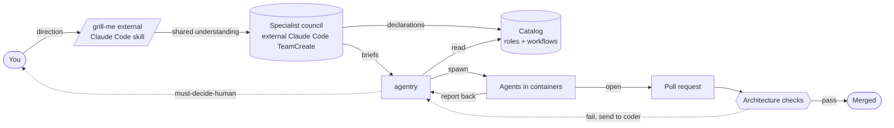

# agentry

A self-governing fleet of AI coding agents. The fleet deliberates,
implements, and enforces its own architecture. You set direction; you
shape the work in dialog with the fleet's lead agent; then you stay
out until something genuinely needs you.

## What it is

agentry runs a fleet of AI coding agents. Each agent is a **role** that
does one job inside a short-lived container — produce a change, review
it, commit it, push it, watch CI — and then exits. The fleet itself
decides which roles run in what order (a **workflow**), how failures
route back for fixes, and what the architecture should look like.

Your articulation surface is **/grill-me** — a structured dialog where
the fleet's lead agent (Claude, in the current setup) interviews you
about the work you want done, branch by branch, until you both share
the same understanding of what's being built and why. Once that
understanding is settled, the fleet takes over: a council of specialist
agents deliberates, produces architectural declarations, decomposes the
work into briefs, and dispatches them. agentry runs the briefs, watches
the agents, opens pull requests, watches CI, and either auto-merges on
green or routes failures back to the coder agent for another iteration.

Roles, workflows, and the architectural declarations the fleet enforces
are all stored as data — JSON files in a catalog (`seed/roles/` for
agents, `seed/topologies/` for workflows) plus markdown specifications
in `specs/`. New shapes don't require a new release. The fleet authors
and registers them.

## Why it exists

AI coding agents produce code that compiles and looks reasonable but
contains subtle integration bugs: a parameter wired through but read
under the wrong name, a helper duplicated when one already exists, a
feature built layer by layer that doesn't connect. Code review catches
some of this. It misses much, especially when no human reviewer can
match the agent's depth in the language being produced.

agentry's bet: the fleet governs itself. Specialist agents convene as a
council before implementing a feature and produce architectural
declarations (which concepts exist, how they relate, what's banned).
Those declarations are committed to the project as machine-readable
specs and ban rules. CI checks the produced code against them on every
pull request. Drift fails the build. The fleet cannot ship code that
violates an architecture it itself agreed on, even if the code passes
its tests.

You stay outside the loop. You direct (what matters, what's next), you
align with the fleet through /grill-me (the only authoring surface
where your voice enters the work), and you're escalated to only for
decisions that genuinely require human judgment. The fleet handles
authoring, deliberation, implementation, and enforcement.

## What it isn't

- Not a chatbot framework. Agents don't converse — they take a brief,
  do the work, and exit.
- Not a CI runner. Your CI sits underneath; agentry watches it.
- Not opinionated about which AI to use. Roles can wrap Claude, Grok,
  Gemini, plain shell scripts, or compiled binaries — anything that
  reads input and writes structured output.
- Not a single-shot tool. agentry holds the loop: change → review →
  commit → push → CI → on-failure route back to coder, repeat.

## Project Profiles

Each target_repo ships its own `.agentry/profile.toml` declaring which tool packs the coder and reviewer consume, the canonical brief acceptance command, and methodology gates. The substrate fetches the profile at brief dispatch and augments the spawned role's effective config — N projects with N requirements without N hardcoded role copies.

- **Profile-driven roles (Phase 1+2 shipped 2026-05-07):** target repos declare their tool requirements in `.agentry/profile.toml`; the substrate is generic across projects. See `specs/concepts/profile.md` and `specs/concepts/tool_pack.md`. Agentry's own profile lives at `.agentry/profile.toml`.
- **rtk substrate fix validated 2026-05-07T21:17Z** — coder containers now have rtk available at /usr/local/bin/rtk via ~/.local/bin/rtk symlink; PreToolUse hook resolves cleanly.
- **Dogfood loop verification 2026-05-07T23:05Z** — second consecutive healthcheck Shipped through coder + reviewer-mech + shipper + ci-watcher; substrate reconciliation in PR #420.
- **Captain doctrine foundation 2026-05-08** — typed Contract / Assertion / TaskShape / ValidatorPipeline + log-only daemon contract observer (B1-B3). Captain authoring discipline encoded as types, not prose.

## Big Rust Projects

- Big-rust workflow ready: dispatch briefs against `agentry-bugfix-v0` topology with `quality-mech` as the acceptance command for scoped reviewer cargo cost. See `docs/dogfood-protocol.md` for the recipe.

agentry's reviewer-mechanical scopes cargo clippy + cargo test to changed crates plus their reverse-dep closure (via quality-mech), and the leaner agentry-bugfix-v0 topology drops the LLM ac-verifier ensemble. Together, brief LLM container count drops from 5 to 1 and cargo cost drops from workspace-wide to scoped — making agentry suitable for big Rust workspaces where the workspace-wide pair blows the brief budget.

## Shape



> Note: `/grill-me` and the specialist council run on the user's Claude Code host — they are not provided by this repository. The `/grill-me` skill is the public one from [mattpocock/skills](https://github.com/mattpocock/skills); the council pattern is described in `docs/architectural-control-loop.md`.

The pieces:

1. **/grill-me.** Where you and the fleet's lead agent reach a shared
   understanding of the work. Your voice enters here.
2. **The council.** Specialist agents who deliberate and write the
   architectural declarations the rest of the loop enforces.
3. **The catalog.** Roles, workflows, and specs as data. Authored by
   the council and the lead agent.
4. **agentry itself.** Reads briefs, runs the workflow, watches the
   agents, records outcomes. The dispatcher runs multiple briefs in
   parallel — capped per project (default 4) so one noisy project can't
   starve another. Within a single brief the roles run sequentially:
   each role's container exits before the next one starts.
5. **The agents.** Short-lived containers, each does one job. Their
   output is the events you see in the dashboard.
6. **The architecture checks.** Run on every pull request. Compare
   what was produced against what the council declared. Block the merge
   on disagreement.

## Try it

```bash
# Local infrastructure (idempotent — safe to re-run).
just dev-redis-up
just agentry-net-up

# Build, generate a signing key, load the starter catalog.
cargo build --release --workspace
./target/release/orchestrator key-gen
./target/release/orchestrator seed

# Run agentry and the dashboard.
./target/release/orchestratord &
./target/release/orchestrator-dashboard &   # http://localhost:7800

# Submit your first brief.
./target/release/orchestrator submit examples/verify-M0.json
```

## Day-to-day commands

```
orchestrator submit <brief.json>           # send work
orchestrator team list / register / show   # manage workflows
orchestrator role list / show              # inspect agents
orchestrator verdicts                      # last N outcomes
orchestrator agents trace <agent-id>       # see what an agent did
agentry-workspace list / gc                # workspace cleanup
```

## Where to read next

- `docs/architectural-control-loop.md` — how a non-trivial feature gets
  designed, agreed on, and turned into briefs. The full loop: /grill-me
  → council → spec → /to-issues → CI fences.
- `docs/dogfood-protocol.md` — what a brief looks like and how to
  dispatch one.
- `specs/concepts/` — the architecture the fleet has declared and the
  CI checker enforces.
- `CLAUDE.md` — house rules for the lead agent (Claude) when working on
  agentry itself.
- `AGENTRY_RESUME.md` — current operational state.
