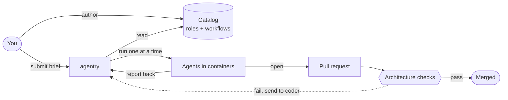

# agentry

A controlled system for running AI coding agents.

You describe what you want built. agentry runs a sequence of AI agents
to build it (a coder, a reviewer, a committer, a verifier — your choice),
opens a pull request, and watches it through to merge. Automatic checks
block the merge if the change drifts from the project's declared design.

## What it is

agentry runs AI coding agents one at a time, each in its own short-lived
container. Each agent is a **role** that does one job — produce a change,
review it, commit it, push it, watch CI — and then exits. You assemble
roles into a **workflow** that describes what runs in what order, who
hands off to whom, and how failures route back for fixes.

You submit a **brief** (what to build, where, how it's accepted).
agentry resolves the named workflow, spawns one container per role,
hands each one the brief, watches the events they emit, and records
the outcome. When the workflow opens a pull request, agentry watches
your CI and either auto-merges on green or routes the failure back to
the coder for a fix.

Workflows are written as small JSON files. Adding a new shape — a
different role ordering, a different rework strategy — does not require
releasing a new version of agentry. You author the workflow, register
it, and dispatch briefs against it.

## Why it exists

AI coding agents produce code that compiles and looks reasonable but
contains subtle integration bugs: a parameter wired through but read
under the wrong name, a helper duplicated when one already exists, a
feature built layer by layer that doesn't connect. Code review catches
some of this. It misses much, especially when the reviewer isn't an
expert in the language being produced.

agentry's bet: catch the drift in the build, not in the human eye. You
declare your architecture once (which concepts exist, how they relate,
what's banned). The project's CI runs a checker that diffs what the
agent produced against your declaration. Drift fails the build. The
agent cannot ship a change that violates the architecture, even if the
change passes its tests and the reviewer doesn't notice.

## What it isn't

- Not a chatbot framework. Agents don't converse — they take a brief,
  do the work, and exit.
- Not a CI runner. Your CI sits underneath; agentry watches it.
- Not opinionated about which AI to use. Roles can wrap Claude, Grok,
  Gemini, plain shell scripts, or compiled binaries — anything that
  reads input and writes structured output.
- Not a single-shot tool. agentry holds the loop: change → review →
  commit → push → CI → on-failure route back to coder, repeat.

## Shape



The pieces:

1. **The catalog.** Your roles and workflows, stored as JSON. You add
   to it; agentry reads from it.
2. **agentry itself.** Reads briefs, runs the workflow, watches the
   agents, records outcomes.
3. **The agents.** Short-lived containers, each does one job. Their
   output is the events you see in the dashboard.
4. **The architecture checks.** Run on every pull request. Compare
   what the agent built against the design you declared. Block the
   merge on disagreement.

## Try it

```bash
# Local infrastructure (idempotent — safe to re-run).
just dev-redis-up
just agentry-net-up

# Build, generate a signing key, load the starter catalog.
cargo build --release --workspace
./target/release/orchestrator key-gen
./target/release/orchestrator seed

# Run agentry and the dashboard.
./target/release/orchestratord &
./target/release/orchestrator-dashboard &   # http://localhost:7800

# Submit your first brief.
./target/release/orchestrator submit examples/verify-M0.json
```

## Day-to-day commands

```
orchestrator submit <brief.json>           # send work
orchestrator team list / register / show   # manage workflows
orchestrator role list / show              # inspect agents
orchestrator verdicts                      # last N outcomes
orchestrator agents trace <agent-id>       # see what an agent did
agentry-workspace list / gc                # workspace cleanup
```

## Where to read next

- `docs/architectural-control-loop.md` — how a non-trivial feature gets
  designed, agreed on, and turned into briefs.
- `docs/dogfood-protocol.md` — what a brief looks like and how to
  dispatch one.
- `specs/concepts/` — the architecture you're enforcing. Each file
  describes one part of the system; the CI checker reads these.
- `CLAUDE.md` — house rules for sessions of Claude that work on
  agentry itself.
- `AGENTRY_RESUME.md` — current operational state.
